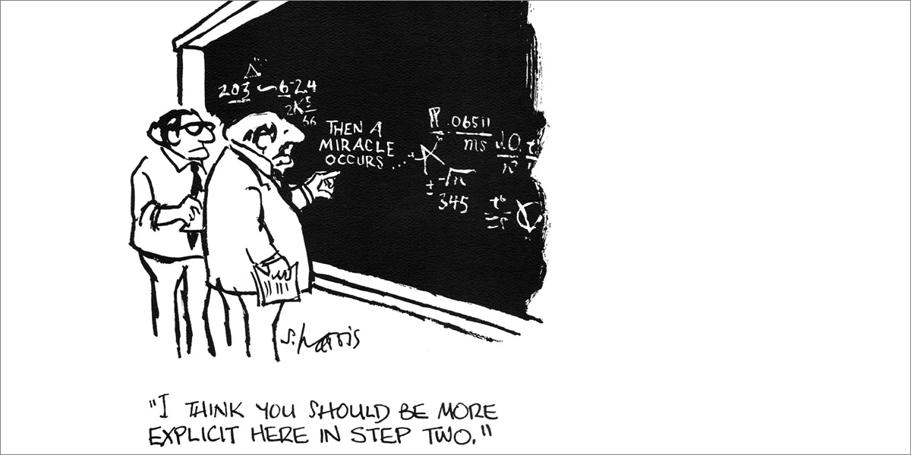
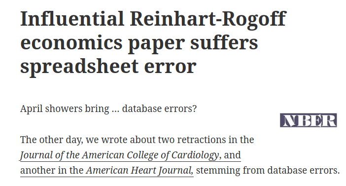
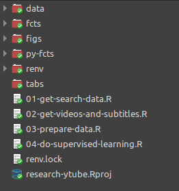

```{r, echo=FALSE}
knitr::opts_chunk$set(echo=FALSE)
```


# Introduction

[What is science?](https://www.google.com/search?q=what+is+science&oq=what+is+science&aqs=chrome.0.0i512l10.2032j0j7&sourceid=chrome&ie=UTF-8)

--

> the intellectual and practical activity encompassing the systematic study of the structure and behaviour of the physical and natural world through observation and experiment. Oxford English Dictionary

--

However, academic research is usually conducted in a black-box fashion:

```{r, out.width=500}

```

---

# Reproducibility failures in academia

.pull-left[
## [Reinhart-Rogoff](https://theconversation.com/the-reinhart-rogoff-error-or-how-not-to-excel-at-economics-13646) error

```{r, echo=FALSE, out.width='100%'}

```

]

.pull-right[

## The recent [case](https://retractionwatch.com/2021/07/08/researchers-forfeit-10000-award-when-papers-findings-cant-be-replicated/) of _Journal of Finance_:

```{r, echo=FALSE, out.width='100%'}
knitr::include_graphics('figs/retraction-jf.png')
```

]

---

# How to solve this problem?

Governance and reproducibility!

--

.pull-left[

```{r, out.width=250}

```

]

.pull-right[

- All data and code should be shared and reproducible with popular programming languages

- Prevalence of academic governance and self-audit

- If particular results are not reproducible, be transparent about it and retract if needed

]


---


# Why we lack reproducibility?

- Researchers are human! An error can happen..

--

- Bad career incentives ( publish or perish!) and bad behavior.

--

- Lack of incentives for sharing code and data.

--

- Bad computational policies (aka "it works on my machine").

---

# Tools for reproducibility in R (and others)

- Well written paper! 

--

- Version control (data & code) 

  - **Git** (Github and friends)
  
  - **Cloud backup and infrastructure** (Dropbox/Google Drive/One Drive)

--

- Instructions for running the R code (perhaps in a git style Readme.md file?)

--

> Example of reproducible paper: A Garch Tutorial with R - RAC  ([paper](https://rac.anpad.org.br/index.php/rac/article/view/1420)/[code](https://github.com/msperlin/GARCH-RAC)/[data](https://dataverse.harvard.edu/dataset.xhtml?persistentId=doi:10.7910/DVN/C4WHUJ))

---

# Reproducibility in R

R offers a range of tools for keeping  your code reproducible

- Project organization (files and folders)

- Package version:

  - `checkpoint`
  
  - `renv`
  
- Containerization with Docker 

---

# Project Organization

- All R scripts numbered sequentially (import --> clean --> EDA --> model)

- Extra files and output in their own folder

- Think of a research project as a R package, with its own folder structure

--

**A real life Example:**

```{r}

```

---

# Package `renv`

> Inspired in Python's _venv_ , `renv` maintain records of all packages used within a project (similar to python)  and provides infrastructure for recording and restoring packages.

--

**How to use:**

1) Install `renv` in R, set path to project folder (or open rstudio project file) and initialize with `renv::init()`

2) Record packages with `renv::snapshot()`

3) Restore (if needed) packages with `renv::restore()`

---

# Package `checkpoint`

> Package `checkpoint` is an initiative from [Microsoft](https://mran.microsoft.com/documents/rro/reproducibility/)
to keep R code reproducible. 

> Unlike `renv` that finds packages from project, `checkpoint` uses time to set package versions and (**slowly**) create a private package repository.

--

**How to use**:

1) install `checkpoint`, set a date you want to reach out

2) go back in time with `checkpoint('2019-01-01')`

---

# Docker

> Containers are modular virtual enviroments that freezes a particular computer setup, mostly used in cloud computing.

- Containers are the _state-of-art_  for code execution and reproducibility (it guarantees a particular architecture, forever).

- For R users, containers are mostly used in deploying shiny applications.

--

---

## Dockerfile example:

```{r, echo = TRUE, eval=FALSE}
FROM rocker/tidyverse:4.1.0

RUN R -e "install.packages('GetDFPData2')"

WORKDIR /home/msperlin

RUN mkdir output

ADD R-code ./R-code

#RUN mkdir /home/output
RUN R -e "getwd()"

RUN R -e "fs::dir_tree()"

WORKDIR /home/msperlin/R-code

CMD Rscript script-research.R
```


---

# Thanks!

```{r}
emo::ji('smile')
```


All code and data available at [Github](https://github.com/msperlin/reproducibility-with-R-talk)

[Personal site](https://www.msperlin.com/blog/)
