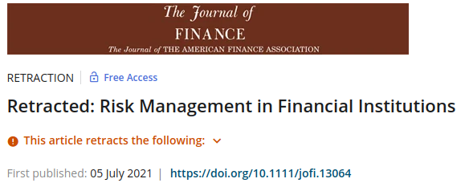

```{r, echo=FALSE}
knitr::opts_chunk$set(echo=FALSE)
```


# Introduction

[What is science?](https://www.google.com/search?q=what+is+science&oq=what+is+science&aqs=chrome.0.0i512l10.2032j0j7&sourceid=chrome&ie=UTF-8)

> the intellectual and practical activity encompassing the systematic study of the structure and behaviour of the physical and natural world through observation and experiment. Oxford English Dictionary

--

However, academic research is usually conducted in a black-box fashion

```{r, out.width=500}

```


# How to solve this problem?

Reproducibility!

--

.pull-left[

```{r, out.width=250}
knitr::include_graphics('figs/359_9_f2.jpeg')
```

]

.pull-right[

- All data and code should be shared and reproducible
- Academic governance and self-audit
- If results are not reproducible, be transparent about it and retract if needed
- 

]

---

# Reproducibility failures in academia

## [Reinhart-Rogoff](https://theconversation.com/the-reinhart-rogoff-error-or-how-not-to-excel-at-economics-13646) error

```{r, echo=FALSE, out.width='50%'}
knitr::include_graphics('figs/reinhart-rogoff.png')
```

--

## The recent [case](https://retractionwatch.com/2021/07/08/researchers-forfeit-10000-award-when-papers-findings-cant-be-replicated/) of _Journal of Finance_:

```{r, echo=FALSE, out.width='50%'}

```

---

# Why we lack reproducibility?

- researchers are human!

--

- bad incentives: publish or perish! 

-- 

- bad computational policies (aka "it works on my machine")

---

# Tools for reproducibility

- Version control (data/code/..) 
  - Github (and friends)
  - Dropbox/GoogleDrive/OneDrive/...

--

- Intructions for running the code (perhaps in a code script?)

--

- Well written paper! 

---

# R workshop

All code and data available at [Github](https://github.com/msperlin/reproducibility-with-R-talk)

- 
